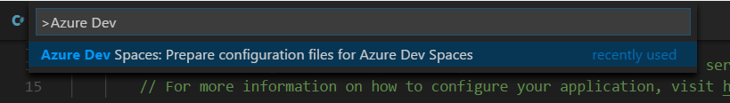

# Script for creating a small k8s cluster in Azure
Perform the prerequisites first!  

## ENVIRONMENT
1. Login to Azure portal and setup your small Kubernetes cluster. Use default setting except for Http application routing. Change that to Yes.  
2. Open a command prompt and run ``` az login ``` to logon and cache credentials to Azure.
3. Run ``` az aks use-dev-spaces -g <resource group for cluster> -n <clustername> ``` to install the Dev-spaces controller in Azure and locally.

## CODE
1. Create a simple web project by running ``` dotnet new mvc --name frontend ```
2. cd into the new folder and run ``` code . ``` to open VS Code.
3. Init azds for the project by running ``` azds prep --public. Public is to enable public http for that service. A number of files is now added to the folder like DockerFile and azds.yaml.
4. Now just run ``` azds up ``` to build, publish and launch the app in the cluster. You are presented with two urls in the console window. One for the public address to the service and one SSL'd to a localhost address.

## DEBUG
1. In VS Code hit Ctrl+Shift+P to open Command Palette and start typing ``` Azure Dev ``` . You should now see Prepare configuration files for Azure Dev Spaces. Run the command.

2. In debug pane you should now have a configuration called ".NET Core Launch (AZDS)". If not, restart VS Code.
3. With that configuration active, hit F5. Problems? Restart VS Code. It's a first time kind of thing.
4. Add a breakpoint in your code and browse to the site.
